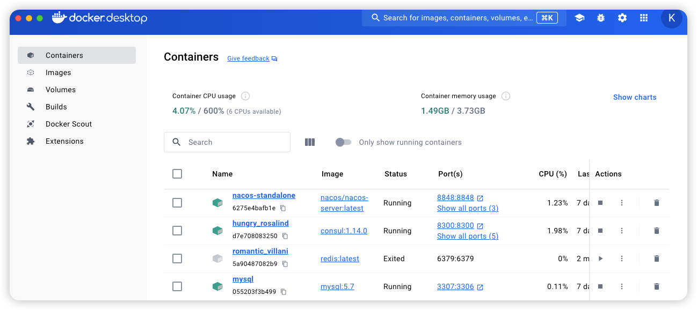
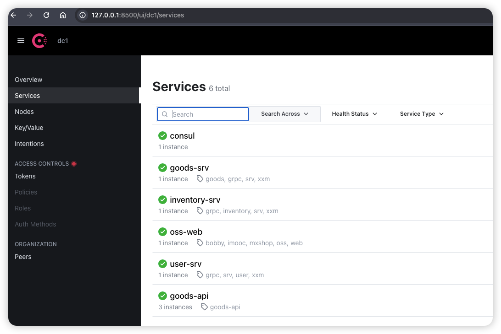
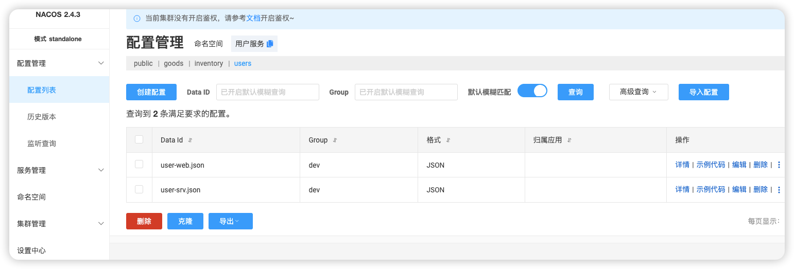
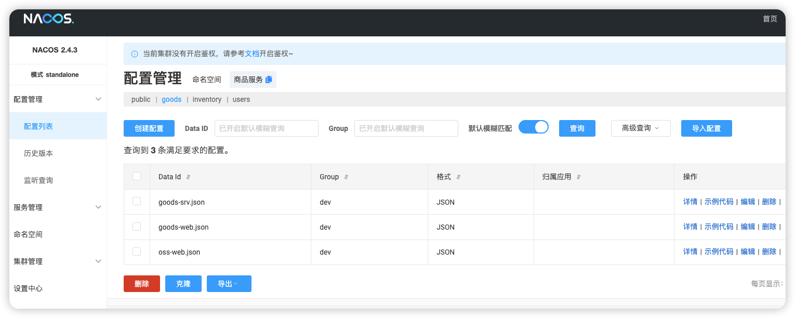

## 容器概览



## 服务概览



## 配置概览



### user-web.json

```json
{
  "name": "user-api",
  "port": 8022,
  "host": "192.168.15.21",
  "tags": ["user-api"],
  "user_srv": {
    "name": "user-srv"
  },
  "jwt": {
    "signing_key": "*n*cxZhL07yss&TphhCg"
  },
  "consul": {
    "host": "192.168.15.21",
    "port": 8500
  }
}
```

### user-srv.json

```json
{
  "name": "user-srv",
  "mysql": {
    "host": "127.0.0.1",
    "port": 3307,
    "db": "mxshop_user_srv",
    "user": "root",
    "password": "root"
  },
  "consul": {
    "host": "192.168.15.21",
    "port": 8500
  }
}
```



### goods-web.json

```json
{
  "name": "goods-api", 
  "port": 8023, 
  "host": "192.168.15.21",
  "tags": ["goods-api"],
  "goods_srv": {
    "name": "goods-srv"
  },
    "jwt": {
    "signing_key": "*n*cxZhL07yss&TphhCg"
  },
  "consul": {
    "host": "192.168.15.21",
    "port": 8500
  }
}
```

### goods-srv.json

```json
{
  "name": "goods-srv",
  "tags": ["xxm", "grpc", "goods", "srv"],
  "mysql": {
    "host": "127.0.0.1",
    "port": 3307,
    "db": "mxshop_goods_srv",
    "user": "root",
    "password": "root"
  },
  "consul": {
    "host": "192.168.15.21",
    "port": 8500
  }
}
```

### oss-web.json

```json
{
  "name": "oss-web",
  "host": "192.168.15.21",
  "tags":["mxshop", "imooc", "bobby", "oss", "web"],
  "port": 8029,
  "oss":{
    "key":"",
    "secrect":"",
    "host":"http://py-go.oss-cn-beijing.aliyuncs.com",
    "callback_url":"http://39.107.30.137:8082/callback",
    "upload_dir":"mxshop-images/"
  },
  "jwt": {
    "key": "*n*cxZhL07yss&TphhCg"
  },
  "consul": {
    "host": "192.168.15.21",
    "port": 8500
  }
}

```

